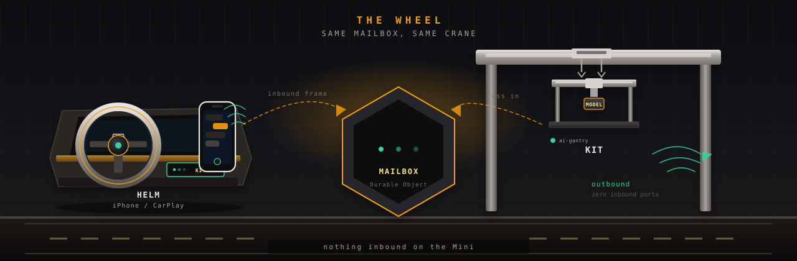
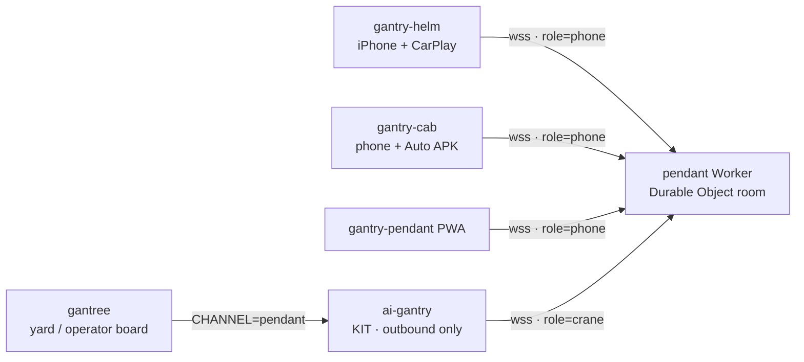

#  gantry-helm

<p align="center">
  
</p>

<p align="center">
  <a href="https://github.com/shotah/gantry-helm/actions/workflows/ci.yml"></a>
  <a href="LICENSE"></a>
</p>

> **gantry** *(n.)* — the rigid frame that holds and positions tools.
>
> **helm** *(n.)* — the wheel on that crane. You hold the iPhone.
> You still talk to the same crane.
>
> [gantry-cab](https://github.com/shotah/gantry-cab) is the seat
> (Android). This is the wheel.

[gantry-pendant](https://github.com/shotah/gantry-pendant) is the
handheld: a Vinext PWA and the Durable Object mailbox. **This app is
the wheel** — the iPhone in your pocket, and Kit as a communication
notification over CarPlay maps. Same room. Same
[ai-gantry](https://github.com/shotah/ai-gantry) crane. The Mini still
opens **zero** inbound ports.
[gantree](https://github.com/shotah/gantree) is the yard board. It
does not sit in a chat turn.

```text
gantry-helm IPA ─┐
gantry-cab APK  ─┼─►  pendant Worker (Durable Object)  ◄──  ai-gantry (outbound)
pendant PWA     ─┘
gantree writes CHANNEL=pendant. It never sits in the turn.
```



Helm is Swift. It does not wrap the Vinext PWA. It does not run
React Native. It does not fork the Worker.

CarPlay reads Kit aloud from a **communication notification**. Spoken
reply becomes `inbound` with `surface: carplay`. The phone thread
uses `surface: ios`. The mailbox currently keeps `browser` /
`android` / `android_auto` and, with this checkout's pendant patch,
`ios` / `carplay`.

Paperclip is the rest of the mouth: photo or camera (caption + JPEG
travel together), slash commands, GPS on send, drop a pin. Kit can
pick the room's mood; you can unfollow and keep yours. Boom is the
default.

| Repo | Job |
| --- | --- |
| **gantry-helm** | This iOS app. Pocket thread + CarPlay message cards. |
| [gantry-cab](https://github.com/shotah/gantry-cab) | Android APK + Android Auto message cards. |
| [gantry-pendant](https://github.com/shotah/gantry-pendant) | Mailbox Worker + handheld PWA. One room per crane slug. |
| [ai-gantry](https://github.com/shotah/ai-gantry) | The crane. `CHANNEL=pendant`. Dials **out**. |
| [gantree](https://github.com/shotah/gantree) | The yard. Writes env and files. Not a mouth. |

## This is not

- A PWA / WKWebView wrapping pendant. CarPlay will not project that.
- An App Store listing (sideload or TestFlight).
- A second mailbox. Forking the Worker is how you get two rooms.
- Sign in with Apple (mailbox auth change — later).
- APNs lock-screen with the process dead. Same later as Cab FCM.

## Talks to pendant

| Call | What |
| --- | --- |
| `GET /api/auth/config` | spike vs Google |
| `GET /api/auth/nonce` | server nonce; mint locally on 404 / junk |
| `POST /api/auth/token` | `{ id_token, nonce }` → session JWE |
| `GET /api/auth/me` | `Authorization: Bearer <jwe>` → `{ sub, email, cranes }` |
| `GET /ws/<slug>?role=phone` | WebSocket. Header is the JWE (Google) or the spike secret |

No cookies. Cookie CSRF is PWA-only. Spike walk: simulator →
`http://127.0.0.1:3000`, paste the mailbox secret. Production: copy
pendant’s **Web** client id into `HELM_GOOGLE_WEB_CLIENT_ID`, and
create a **new iOS** OAuth client (bundle `com.gantree.helm`). Helm
POSTs the token to `/api/auth/token` — Google is not given a Helm
callback.

## Hello

Xcode on a Mac opens `app/Helm.xcodeproj` (local Swift package
`Mailbox`). Linux / CI run the mailbox tests, same shape as
[gantry-cab](https://github.com/shotah/gantry-cab):

```bash
make test            # script tests + Mailbox swift test
make coverage        # llvm-cov + 70% bar (Mailbox)
make check-app       # test + coverage
make install-hooks   # pre-commit: tests; pre-push: coverage
make ios             # xcodebuild, unsigned (macOS)
make release         # bump patch, tag, push
make release DRY_RUN=1
```

Needs Swift 5.9+ for `swift test`. CI uses Swift 6.3.3 and Node 24.
The IPA needs Xcode 15+ / iOS 17.
Nested checkout under gantree (`repos/gantry-helm`), own git remote,
same pattern as `repos/gantry-cab`. Walk: [docs/setup.md](docs/setup.md).
Linux / this Deck (Docker `swift:6.3.3`, no host toolchain):
[docs/development.md](docs/development.md).

```bash
# on the pendant checkout
npm run dev          # 127.0.0.1:3000 — simulator reaches it as itself
```

In Helm: origin `http://127.0.0.1:3000`, slug `kit`, spike secret from
`.dev.vars`. Type. Reply in the crane tab.

Google Sign-In needs **two** OAuth clients in pendant’s GCP project:
the existing **Web** client id in `HELM_GOOGLE_WEB_CLIENT_ID` (copied
from pendant — that is the token `aud`), and a **new iOS** client
(`com.gantree.helm`). The iOS client has **no** redirect URI. Helm
never opens Safari for the token; it POSTs the ID token to the
mailbox `/api/auth/token`.

Close `4401` / handshake 401 drops the stored JWE; 403 does not.

## CarPlay

Communication notifications (`UNNotificationCategory` +
`INSendMessageIntent` + reply) are the car. Kit's reply is a message
card over maps; CarPlay reads it and takes a spoken reply. That is
the whole sideload story.

A CarPlay **app tile** needs the CarPlay messaging entitlement and
Apple's blessing. Do not expect a Helm icon in the car from a
sideload. Settings → **Test car voice** posts a check card through
the same path.

Foreground socket while Helm is open, you Connect, or you send — not
on boot. CarPlay cannot start Helm, so **open the app and send a line
before you plug in**, then lock the phone. iOS is stricter than
Android about background sockets; if you reboot, open Helm again.
APNs lock-screen (process dead, iMessage-class) is not demo / POC /
family-beta; it is if Helm becomes a public service. Design:
[docs/apns_design_and_todo.md](docs/apns_design_and_todo.md).

Open work: [docs/todo.md](docs/todo.md). Mailbox handoff:
[docs/pendant_handoff.md](docs/pendant_handoff.md). Phone install:
[docs/sideload_to_ios.md](docs/sideload_to_ios.md). Make the car talk:
[docs/carplay_setup.md](docs/carplay_setup.md). Deck / Docker test
walk: [docs/development.md](docs/development.md).
