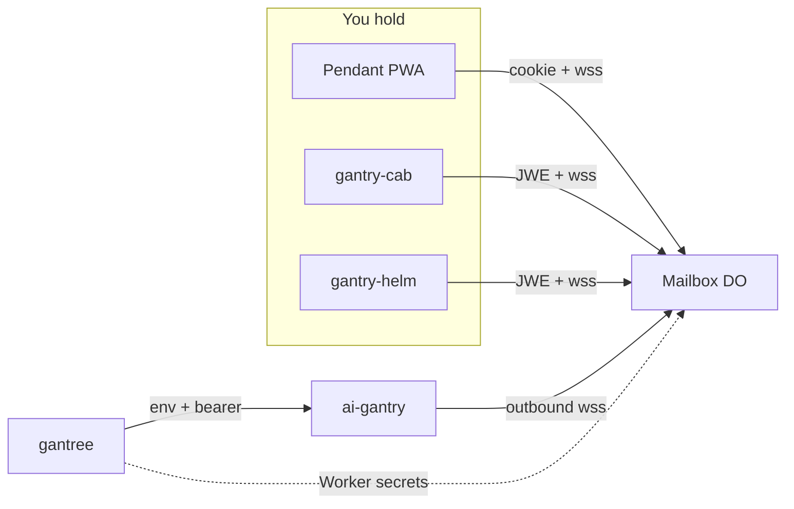

# Architecture

How an iPhone we own talks to a crane without a listen port on the
harness. Contract: [design.md](design.md). Pitch:
[root readme](../README.md). Mailbox wire (canonical):
[gantry-pendant `docs/frontends.md`](https://github.com/shotah/gantry-pendant/blob/main/docs/frontends.md).

## Household

Five checkouts. Nested under gantree (`repos/…`), each with its own
git remote — same pattern as `repos/ai-gantry`.



```text
gantry-helm IPA  ─┐
gantry-cab APK   ─┼─►  pendant Worker (Durable Object)  ◄──  ai-gantry (outbound)
pendant PWA      ─┘
gantree writes CHANNEL=pendant. It never sits in the turn.
```

Gantree never grows a chat route. Helm never deploys a Worker.

## This checkout

```text
gantry-helm/
  Package.swift            Mailbox library + MailboxTests
  Sources/Mailbox/         Foundation wire (Cab mailbox parity)
  Tests/MailboxTests/      XCTest next to the package (SPM layout)
  app/Helm                 SwiftUI + CarPlay shell (thin; owns Keychain / URLSession)
  docs/                    design, architecture, todo, setup
  scripts/                 coverage, hooks, release
  test/scripts/            bash tests for those scripts
```

`Sources/Mailbox` is what Cab's todo calls `:mailbox` — Android-free
helpers. The 70% coverage bar is **this tree**, not the views.

| File | Job |
| --- | --- |
| `Wire` / `JSON` | Frame encode / parse. Additive keys dropped. Phone does not send `seq` / `at`. |
| `Text` | `stripHarnessContext` before `inbound` text hits the wire |
| `MailboxUrl` | slug + `wss …/ws/<slug>?role=phone`. Creds stay on `Authorization` |
| `MailboxConnect` | When the socket may open; 4401 / 401 drop the JWE; 403 does not |
| `Auth` | `GET /api/auth/config`, nonce, `POST /api/auth/token`, `/me` |
| `Mouth` / `Thread` | Ingest, place-in-thread, draft→reply `kit-live` compose key |
| `ThreadCache` | Last room on disk; connect `since` is the highest cached seq |
| `Photo` / `Jpeg` / `SendError` | Same caps and refusal tokens as Cab / pendant |
| `Emoji` / `Slash` / `Look` / `Palette` | Catalog + Boom-default themes |
| `Avatar` / `GeoHint` / `GoogleHint` | Face / GPS / sign-in copy |
| `NotifyGate` | When a HUN / CarPlay card / buzz may fire (`shouldSpeak` cousin) |

URLSession, Keychain, Google Sign-In SDK, SwiftUI, and CarPlay are
**app** work. Do not wait for a pendant agent to invent a Helm-only
kind.

## Talks to pendant

| Call | What |
| --- | --- |
| `GET /api/auth/config` | spike vs Google. Additive `version` / `dev` are dropped. |
| `GET /api/auth/nonce` | Server nonce; junk / 404 → `mintNonce()` |
| `POST /api/auth/token` | `{ id_token, nonce }` → session JWE |
| `GET /api/auth/me` | `Authorization: Bearer <jwe>` → `{ sub, email, cranes }` |
| `GET /ws/<slug>?role=phone` | WebSocket. Header is the JWE (Google) or the spike secret |

Cookie CSRF is PWA-only. Helm must not store `pendant_session`.
`GET /api/auth/google` and `GET /api/auth/logout` are the browser
flow. Sign-out is drop the JWE.

Spike walk: Simulator → `http://127.0.0.1:3000`, paste the mailbox
secret. Production: pendant **Web** client id in
`HELM_GOOGLE_WEB_CLIENT_ID`, plus a **new iOS** OAuth client
(bundle id, no redirect URI you invent — Google's SDK owns that).
Helm POSTs the token to `/api/auth/token`.

## Room

The room is **per crane slug**. Sessions are **per human** (`sub`).

- Phone frames go to the crane. Crane `reply` fans to that `sub`.
  `push` with no `user_id` broadcasts.
- **Sibling phones** (PWA + Cab + Helm, same Google `sub`): live
  `inbound` fans to `sub:<userId>` except the sender. Walk:
  [sibling_phones.md](sibling_phones.md).
- Transcript hydrate replays last 80 `inbound` / `reply` / `push`
  with `replay: true`. `NotifyGate` / `shouldSpeak` skip HUNs on
  replay.
- Do not send `seq` / `at`. The mailbox stamps those. Reconnect
  `since` is the highest seq.

Wire generosity and GPS: pendant
[design.md](https://github.com/shotah/gantry-pendant/blob/main/docs/design.md#phone-context-gps-first).
`surface` on this mouth is `ios` / later `carplay`.

## What has to be reachable

```text
iPhone  ──needs a path to──►  Worker (public HTTPS, token required)
crane   ──dials out to──────►  same Worker
Worker  ──routes to─────────►  Durable Object (crane slug)
gantry  ──never listens
gantree ──unchanged
```

**Not the path:** Cloudflare Tunnel to `gantree:3000`. That is the
yard. Chat does not use it.

## CarPlay and APNs

CarPlay is a mouth skin: host STT → the same `inbound` text, host
TTS of `reply` / `push`. The Completer never sees a clip. Design
cousin: pendant `docs/voice.md`. Gate logic is already in
`NotifyGate` (`shouldPost`, `carTestBlocked`).

APNs is lock-screen when the process is dead. That is **not**
family-beta. Sideload CarPlay (when it exists) is: open Helm, send
a line, project, drive. Design: [apns_design_and_todo.md](apns_design_and_todo.md).

## Why not these shapes

| Shape | Why not |
| --- | --- |
| Second Durable Object for Swift | The room is per crane, not per OS |
| Sign in with Apple as a Helm-only door | Mailbox must accept the token first |
| Expo / Capacitor wrapping the PWA | Cab already proved native is the car path |
| Phone talks to `gantree:3000` | Console in the turn |
| CloudKit as the mailbox | Crane cannot dial Apple; we already have a Worker |
